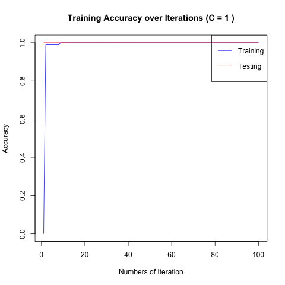
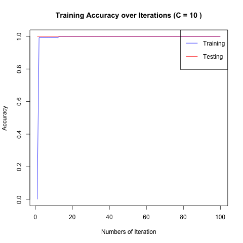

# Statistical Machine Learning — R & Python

Implementations and analyses from STATS 406 (Statistical Computing and Machine Learning) at Northwestern University, covering regression, matrix decomposition, classification, and neural networks in both R and Python.

---

## Implementations

### Sweep Operator (`sweep_operator.R`, `sweep_operator.cpp`)
From-scratch implementation of the Sweep operator — a numerically stable algorithm for matrix inversion and linear system solving used in statistical computing.
- Pure R implementation
- C++ variant for performance; benchmarked against R in `sweep-operator-benchmark.Rmd`

---

## Analyses

| File | Topic | Tools |
|------|-------|-------|
| `linear-algebra-statistics.Rmd` | Linear algebra foundations; Monte Carlo simulation; exploratory data analysis | R |
| `housing-price-regression.Rmd` | Linear regression on LA housing prices; feature selection; model diagnostics | R, tidyverse |
| `face-recognition-pca-nmf.ipynb` | Dimensionality reduction: PCA and Non-negative Matrix Factorization on face image data | Python, NumPy |
| `basis-function-regression.ipynb` | Polynomial and basis function regression; bias-variance tradeoff | Python, NumPy |
| `digit-classification-svm.Rmd` | Support Vector Machine for handwritten digit classification; kernel selection | R |
| `neural-network.ipynb` | Feedforward neural network with manual backpropagation and PyTorch | Python, NumPy, PyTorch |
| `sweep-operator-benchmark.Rmd` | R vs C++ performance comparison of the Sweep operator | R, Rcpp |

---

## Results

SVM classification results at different regularization strengths (C = 0.1, 1, 10):

| C = 0.1 | C = 1 | C = 10 |
|---------|-------|--------|
|  |  |  |

---

## Datasets (`data/`)

| File | Description |
|------|-------------|
| `LAhousingpricesaug2013.txt` | LA single-family home sales & prices |
| `amazonbooks.csv` | Amazon book ratings |
| `baby.csv` | Infant health measurements |
| `digits.csv` | Handwritten digit pixel features |
| `face.txt` | Face image matrix for PCA/NMF |
| `hw4_sample.txt` | Regression sample dataset |

---

## Topics Covered

- Linear algebra and Monte Carlo methods
- Linear & polynomial regression (closed-form and gradient descent)
- Sweep operator (matrix inversion in statistical computing)
- Dimensionality reduction: PCA, Non-negative Matrix Factorization (NMF)
- Support Vector Machines with kernel methods
- Neural networks: manual backpropagation + PyTorch
- Regularization: L1/L2, cross-validation

## Tech Stack

- **R** — tidyverse, Rcpp
- **Python** — NumPy, PyTorch, matplotlib
- **C++** — performance-critical Sweep operator
